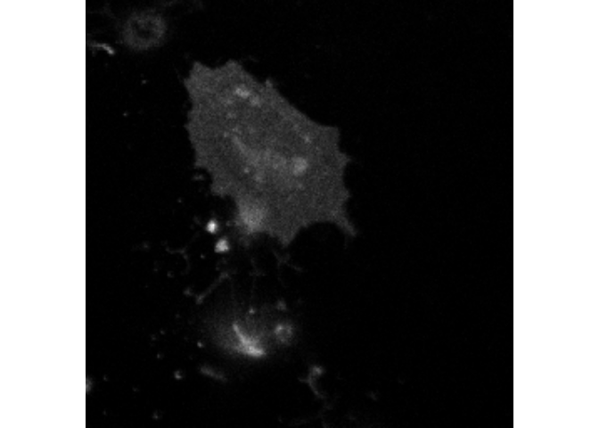

nandb
================

An R package for performing number and brightness analysis as in Digman et al. 2008.

Installation
------------

This is slightly painful but you'll only have to do it once. First of all, if you're on Ubuntu (similarly for other linux), you need to do:

    sudo apt-get install libssl-dev libtiff5-dev libfftw3-dev libcurl4-openssl-dev libxml2-dev

Open R and run:

``` r
install.packages("devtools")
source("https://bioconductor.org/biocLite.R")
biocLite("EBImage")
```

If you get a message saying `Update all/some/none? [a/s/n]:`, type `a`. Then run

``` r
devtools::install_github("rorynolan/filesstrings")
devtools::install_github("rorynolan/nandb")
```

Done.

### Updates

To update the package, you just need

``` r
devtools::install_github("rorynolan/filesstrings")
devtools::install_github("rorynolan/nandb")
```

To check if you need an update, check if the package has been updated since you installed it. To check your current version, use `packageVersion("nandb")`. To check if there's a newer version, go to the github page \[github.com/rorynolan/filesstrings\] (you're probably there right now) and look for the version in the description file.

If you don't want to bother checking and you just want to make sure you have the latest version, just run those two lines of code.

Use
---

For the lowdown on how to use this package, you should read the package vignette; however, here's a quick example. First load the libraries:

``` r
library("nandb")
library("magrittr")
```

Then load the .tif file included with the package:

``` r
tif_file_location <- system.file("extdata", 
                                 "FKBP-mClover_before_0.5nM_AP1510.tif", 
                                 package = "nandb")
img <- ReadImageData(tif_file_location)
```

This `img` is a 3-dimensional array of image slices, where each element corresponds to a pixel with a value of integer counts. Looking at the dimensions of this object:

``` r
dim(img)
#> [1] 256 256  50
```

we can see that it is 50 slices each of which is a 256x256 image. We can view the first slice:

``` r
EBImage::display(EBImage::normalize(img[, , 1]), method = "raster")
```



Now we can calculate the brightness image based on this image series, with an exponential filtering detrend with a time constant of (say) 10 frames via

``` r
img_brightness <- Brightness(img, tau = 10)
```

Now we can see the (median filtered) version of the output.

``` r
img_brightness %>% MedianFilterB %>% 
  MatrixRasterPlot(scale.name = "brightness", limits = c(0.9, 1.5))
```


